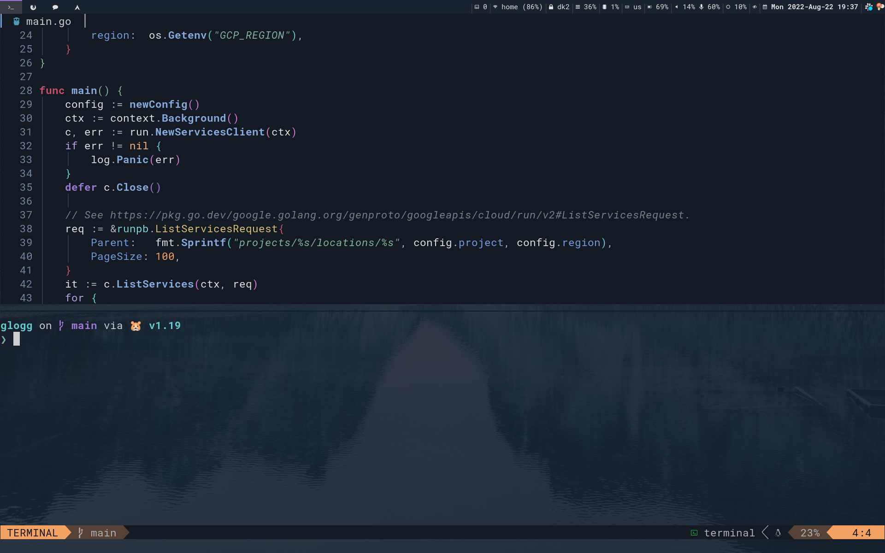

# My Neovim config

It's very much a work in progress :construction: However, I've been using this setup for a couple of months now and feels quite stable nowadays, so I thought it might be worth sharing now.

### Start screen

### [Toggle Terminal](https://github.com/akinsho/toggleterm.nvim)

### File manager - [nnn.nvim](https://github.com/luukvbaal/nnn.nvim)

### Copilot - [copilot](https://github.com/github/copilot.vim)

### Motions on speed - [hop.nvim](https://github.com/phaazon/hop.nvim)

### Fuzzy search - [telescope.nvim](https://github.com/nvim-telescope/telescope.nvim)

### Display keybindings - [which-key.nvim](https://github.com/folke/which-key.nvim)

### Debugging - [nvim-dap](https://github.com/mfussenegger/nvim-dap)

